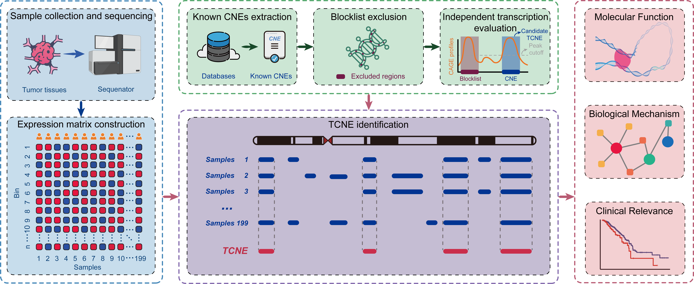

----------
- <font face = "Times New Roman" size = 4> ***[captureTCNE](#capturetcne)*** </font>
  - <font face = "Times New Roman" size = 3> ***[Requirement](#requirement)*** </font>
  - <font face = "Times New Roman" size = 3> ***[Usage](#usage)*** </font>
  - <font face = "Times New Roman" size = 3> ***[Citation](#citation)*** </font>
----------

# captureTCNE
<font face = "Times New Roman" size = 5> **A tailored identification pipeline to depict the landscape of transcribed conversed non-coding elements (TCNEs)** </font>

## Requirement
<font face = "Times New Roman" size = 4> ***To use the current release*** </font>
<font face = "Times New Roman" size = 3>
1. Linux (such as Ubuntu 22.04.3 LTS);
2. R 4.2.3;
3. Python 3.9.16;
4. stringTie 2.2.0;
5. BEDTools suite 2.30.0;
6. R library - fitdistrplus_1.1-11;
7. Jim Kent's executable programms: http://hgdownload.cse.ucsc.edu/admin/exe/;
</font>

## Usage
<font face = "Times New Roman" size = 4> ***Try this program locally:*** </font>

```shell
$ git clone https://github.com/weylz/captureTCNE.git
$ cd captureTCNE
$ chmod u+x *.sh *.R *.py
$ export PATH=$(pwd):$PATH

$ captureTCNE.sh -h

# Usage:    captureTCNE.sh -g <...> -r <...> [-m <...>] [-c <...>] [-v] [-h]

#     Note: -g and -r are required.

# Requirement:
#     - Python 3.6 or later;
#     - R 4.0 or later (library fitdistrplus 1.1-8);
#     - BEDTools suite v2.30.0;
#     - Jim Kent's executable programms: http://hgdownload.cse.ucsc.edu/admin/exe/

# Options:
#     -h    Print this help menu.
#     -g    Label for sample group. The name of the sample group label (the name o
#     -r    Absolute Path of reference element file. The bed file without a headerd, and name, respectively.
#     -m    Minimum number (included) of transcriptional signals in the sample gro
#     -c    Excluding samples of sample group with TPM values in the lower ... of
#     -v    The version of this tool.
```

<font face = "Times New Roman" size = 4> ***An example:***</font>
```shell
$ cd ./examples/
$ directory_workspace=$(pwd)
$ [ -e $directory_workspace/REFERENCE/assembly_BRCA ] || mkdir $directory_workspace/REFERENCE/assembly_BRCA
$ cd $directory_workspace/REFERENCE/assembly_BRCA

# Obtain candidate TCNEs
$ path_to_bam='Path to the folder including all BAM files in the cohort'
$ generateREF.sh $path_to_bam $directory_workspace/REFERENCE BRCA

# Final TCNEs identification workflow
$ cd $directory_workspace
$ captureTCNE.sh -g BRCA -r $directory_workspace/REFERENCE/filtered_CNEs_BRCA.bed -m 1 -c 0.05
# captureTCNE.sh -g $group_name -r $candidate_TCNE -m $min_Num -c $expr_threshold
# The final report can be accessed in the project folder (./BRCA/TCNE.BRCA.bed).
```

## Citation
<font face = "Times New Roman" size = 3> [Wenyong Zhu et al. Emerging functional and mechanistic paradigms of transcribed non-coding elements in breast cancer. *Under review*.](https://www.researchgate.net/profile/Wenyong-Zhu/publications) </font>

<font face = "Times New Roman" size = 2> ***Copyright © 2024 Wenyong Zhu et al. All Rights Reserved.*** </font>
